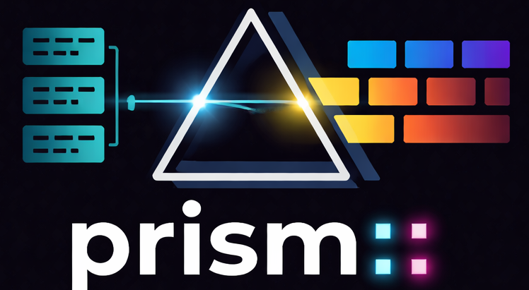
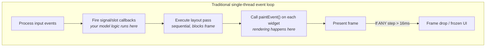
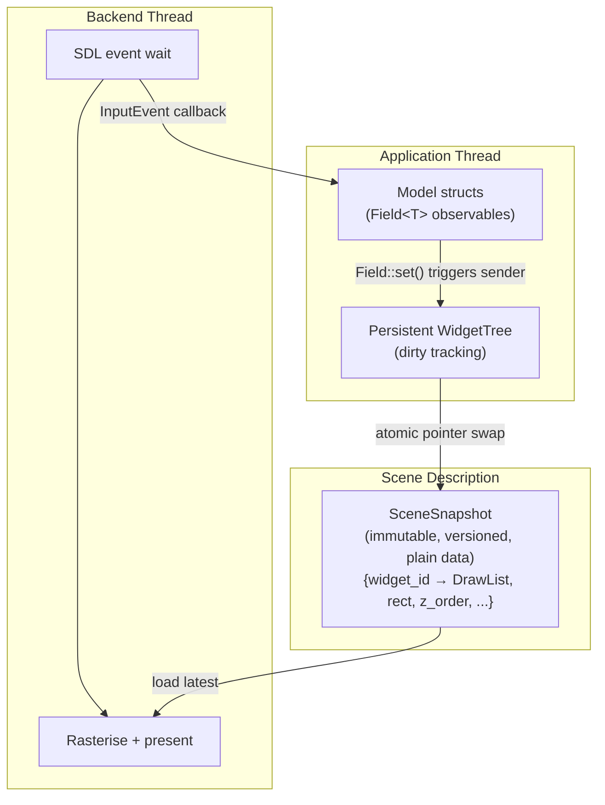
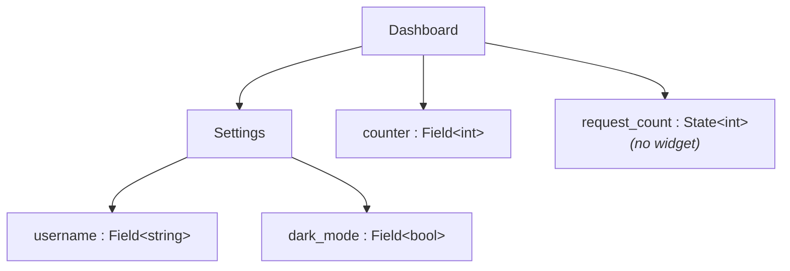
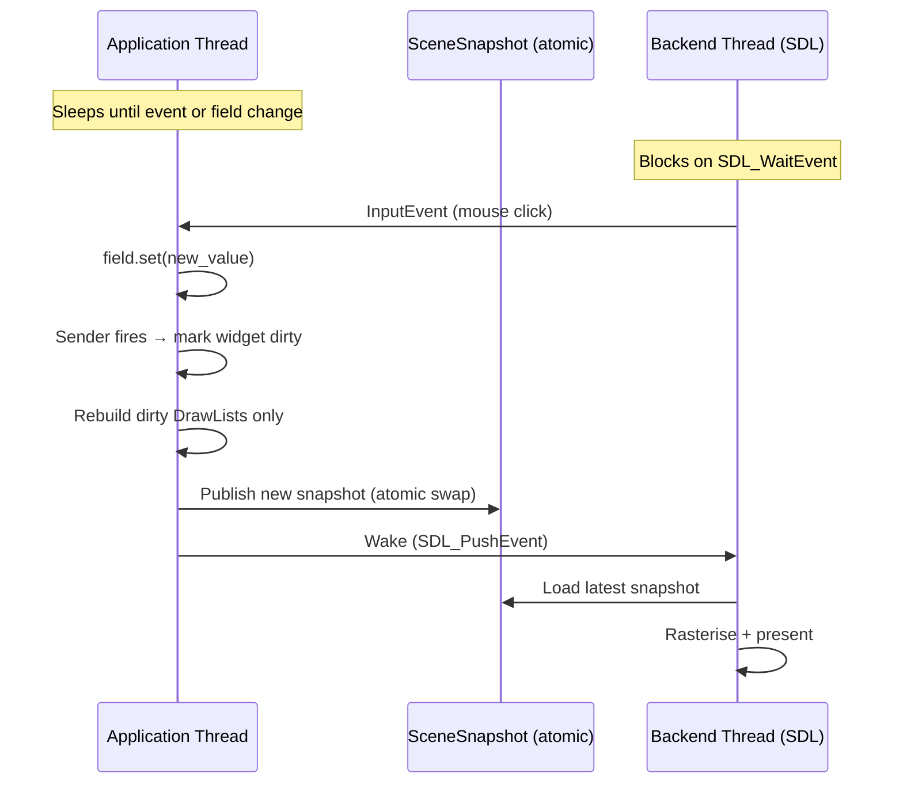
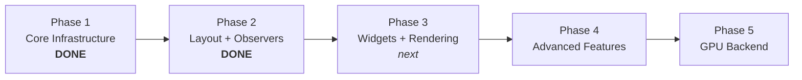

<p align="center">
  
</p>

# PRISM — Persistent Rendering & Interactive Scene Model

**This is an R&D experiment** — exploring what a 2D UI toolkit could look like if built from scratch in C++26 with no legacy constraints. Nothing here is production-ready.

> Take Qt's persistent widget tree, strip away moc and QObject, replace signal/slot strings with C++26 senders, and let P2996 reflection generate the UI from plain structs.

## The Problem

Every major UI toolkit — Qt, GTK, wxWidgets — couples the application and the renderer on a single thread. Rendering competes with business logic for CPU time, and if any step exceeds the frame budget, the UI freezes.



This is an **architectural problem**, not a tuning problem.

## Architecture

PRISM decouples the application from the renderer through a versioned, immutable scene snapshot exchanged via atomic pointer swap. Both threads sleep at OS level when idle — zero CPU when nothing changes.



**The frame contract:** the renderer guarantees frame delivery independent of application state. The application never blocks the renderer. The renderer never calls into application code.

## Core Abstractions: `Field<T>` and `State<T>`

Two observable types share the same core (`.get()`, `.set()`, `.on_change()`):

- **`Field<T>`** — data + observable + **widget** (reflection generates UI for it)
- **`State<T>`** — data + observable + **no widget** (backend state, synchronisation)

```cpp
struct Settings {
    prism::Field<std::string> username{"jeandet"};  // → text input
    prism::Field<bool>        dark_mode{true};       // → checkbox
    prism::State<std::string> session_token{""};     // → no widget, still observable
};
```

`Field<T>` holds only the value — no display label. The member name via P2996 reflection provides identity. Display labels are a form-layout concern.

Both support equality-guarded `set()` (no spurious notifications) and RAII `Connection` lifetime on `on_change()`.

## Sentinel Types & Delegates

The type inside `Field<T>` determines which **delegate** renders it. Sentinel types are templated wrappers that encode presentation semantics:

```cpp
struct Editor {
    prism::Field<std::string>         title{""};                                    // → text input (default for StringLike)
    prism::Field<prism::Label<>>      status{{"OK"}};                               // → read-only label
    prism::Field<prism::Password<>>   secret{""};                                   // → masked input
    prism::Field<prism::Slider<>>     volume{{.value = 0.8}};                       // → continuous slider
    prism::Field<prism::Slider<int>>  quality{{.value = 3, .min = 1,
                                               .max = 5, .step = 1}};              // → discrete slider
};
```

Delegates are resolved at compile time via **concepts**, not concrete types. A delegate matches on traits (`StringLike`, `Numeric`, `SliderRenderable`), so custom types work automatically if they satisfy the right concept:

```cpp
// Your own string type works in Label<> if it satisfies StringLike
prism::Field<prism::Label<MyString>> info{{my_string}};
```

## Component Model

Components are plain model structs. Compose by nesting — no inheritance, no macros:

```cpp
struct Settings {
    prism::Field<std::string> username{"jeandet"};
    prism::Field<bool>        dark_mode{true};
};

struct Dashboard {
    Settings settings;                   // nested component
    prism::Field<int> counter{0};
    prism::State<int> request_count{0};  // observable, no widget
};
```



C++26 reflection (`P2996`) walks the struct members at compile time — `Field<T>` gets a widget, `State<T>` is skipped, nested structs recurse. No registration, no moc, no string-based identity.

## Three Entry Points


**1. Model-driven** (primary API) — define model structs, reflection does the rest:
```cpp
Dashboard dashboard;
prism::model_app("My App", dashboard);
```

**2. Retained layout** — manual `row()`/`column()`/`spacer()` composition:
```cpp
prism::app<State>("App", State{},
    [](auto& ui) { ui.column([&] { /* ... */ }); },
    [](State& s, const prism::InputEvent& ev) { /* ... */ }
);
```

**3. Raw DrawList** — direct rendering, no state management:
```cpp
prism::App app({.title = "Hello", .width = 800, .height = 600});
app.run([](prism::Frame& frame) {
    frame.filled_rect({10, 10, 200, 100}, prism::Color::rgba(0, 120, 215));
});
```

## Threading Model



Both threads sleep at OS level when idle (futex / SDL event wait). Zero CPU when nothing changes.

## C++26 Features

| Feature | Used for |
|---|---|
| Static Reflection (P2996) | Walk model structs, map `Field<T>` to widgets, generate UI |
| `std::execution` (P2300) | Signal/slot scheduling, async pipeline (future) |
| Senders/receivers | Observer pattern — `Field<T>::on_change()` + `SenderHub` |
| Concepts & Constraints | Delegate resolution (`StringLike`, `Numeric`, `SliderRenderable`), composability rules |
| `std::expected` | Fallible API operations — no exceptions at API boundary |
| Designated initialisers | Named-parameter widget construction |

## Building

Requires **GCC 16+** with C++26 reflection support and **Meson >= 1.5**.

```bash
meson setup builddir
ninja -C builddir
meson test -C builddir
```

The build automatically passes `-freflection` for P2996 support. Dependencies (SDL3, doctest) are fetched via Meson wraps.

## Roadmap



- **Phase 1** (done) — MPSC queue, DrawList, SceneSnapshot, SDL3 backend, event-driven loop
- **Phase 2** (done) — Layout engine, hit testing, `Connection`/`SenderHub`, `Field<T>`, `List<T>`, P2996 reflection, `WidgetTree`, `model_app()`
- **Phase 3** (in progress) — Real widget rendering, hit_test→sender routing, concept-based delegate dispatch, `State<T>`, sentinel types (`Label<T>`, `Slider<T>`), SDL_Renderer + SDL3_ttf text rendering, built-in widgets (button, label, text field, checkbox, slider)
- **Phase 4** — Async sender composition, animation, accessibility, data widgets (plot, table)
- **Phase 5** — Vulkan/WebGPU backend, SDF text, tile compositing, Python bindings

## Design Documents

Detailed design rationale for each subsystem lives in [`doc/design/`](doc/design/):

- [Threading Model](doc/design/threading-model.md) — lock-free snapshot handoff, thread roles, input flow
- [Scene Snapshot](doc/design/scene-snapshot.md) — structure, versioning, dirty repaint model
- [Draw List](doc/design/draw-list.md) — command set, extensibility, serialisation
- [Render Backend](doc/design/render-backend.md) — BackendBase vtable, software vs GPU path
- [Input Events](doc/design/input-events.md) — input queue, event forwarding, hit testing
- [Layout Engine](docs/superpowers/specs/2026-03-27-layout-hit-regions-design.md) — row/column/spacer, two-pass solver, hit testing
- [Field/Sender/Widget Spec](docs/superpowers/specs/2026-03-27-field-sender-widget-design.md) — Field<T>, observer pattern, persistent widget tree
- [Delegates & Sentinels](doc/design/delegates-and-sentinels.md) — concept-driven delegates, templated sentinel types, Field vs State
- [SDL_Renderer Migration](docs/superpowers/specs/2026-03-28-sdl-renderer-migration-design.md) — SDL_Renderer + SDL3_ttf replaces PixelBuffer surface-blit
- [Styling](doc/design/styling.md) — theme as data, context propagation (draft)

## License

MIT
