<p align="center">
  
</p>

# PRISM — Persistent Rendering & Interactive Scene Model

**This is an R&D experiment** — exploring what a 2D UI toolkit could look like if built from scratch in modern C++ with no legacy constraints. Nothing here is production-ready.

> Take Qt's persistent widget tree, strip away moc and QObject, replace signal/slot strings with C++26 senders, and let model structs generate the UI — via P2996 reflection on C++26, or manual `view()` on C++23.

## The Problem

Every major UI toolkit — Qt, GTK, wxWidgets — couples the application and the renderer on a single thread. Rendering competes with business logic for CPU time, and if any step exceeds the frame budget, the UI freezes.

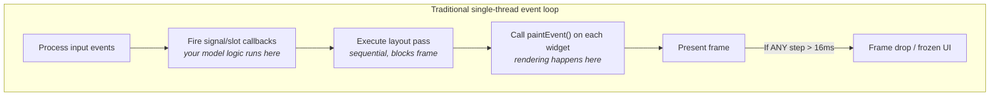

This is an **architectural problem**, not a tuning problem.

## Architecture — Model-View-Behavior (MVB)

PRISM follows a **Model-View-Behavior** pattern:

- **Model** — plain structs with `Field<T>` members. Data + change notification. Knows nothing about rendering or input.
- **View** — `Widget<T>` specializations. Per-type rendering and widget-level input mechanics, automatic via P2996 reflection. PRISM-internal.
- **Behavior** — user-written `on_change()` / `observe()` chains. Business logic that reacts to field mutations.

The application and renderer are decoupled through a versioned, immutable scene snapshot exchanged via atomic pointer swap. Both threads sleep at OS level when idle — zero CPU when nothing changes.

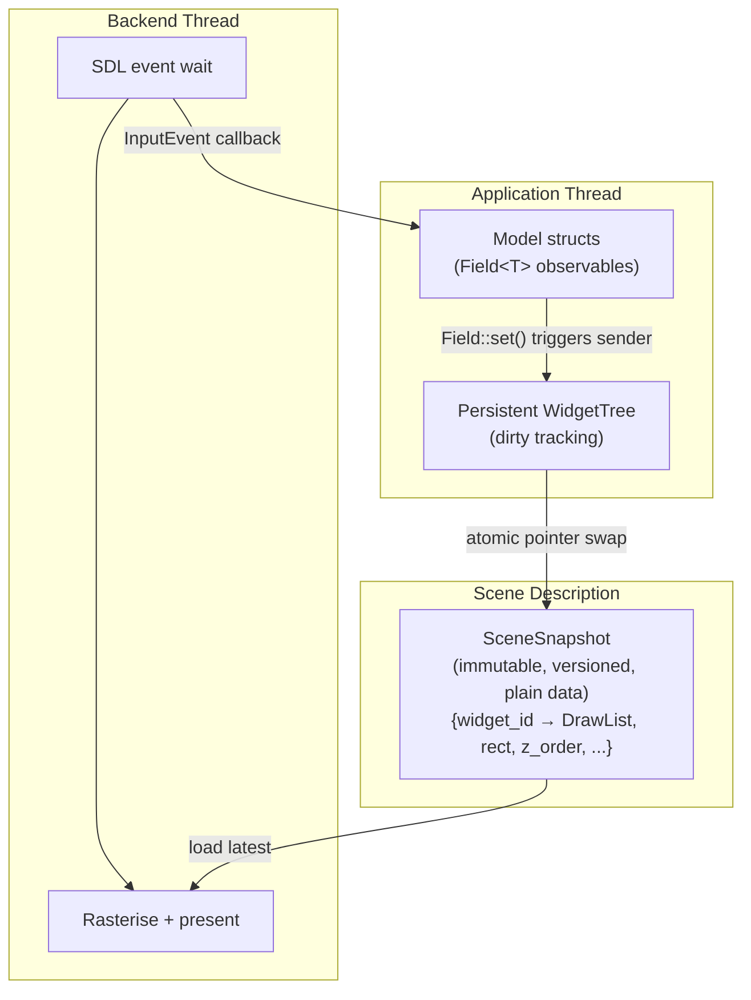

**The frame contract:** the renderer guarantees frame delivery independent of application state. The application never blocks the renderer. The renderer never calls into application code.

## Quick Tour

Screenshots are auto-generated: each model is compiled, rendered headlessly, and exported as SVG. Run `scripts/update_screenshots.sh` to regenerate.

**Hello World** — define a struct, get a UI. With C++26 reflection, there is no boilerplate:

```cpp
struct Counter {
    prism::Field<int> count{42};
    prism::Field<std::string> label{"Hello, PRISM!"};
};

Counter counter;
prism::model_app("My App", counter);  // reflection generates the UI
```

<p align="center">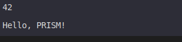</p>

On C++23 (no reflection), add a one-liner `view()` method — same result:

```cpp
void view(prism::WidgetTree::ViewBuilder& vb) { vb.vstack(count, label); }
```

**Widgets from types** — the type inside `Field<T>` determines the widget. No registration:

```cpp
struct AudioMixer {
    prism::Field<prism::Slider<>> volume{{.value = 0.75, .min = 0.0, .max = 1.0}};
    prism::Field<prism::Slider<int>> quality{{.value = 3, .min = 1, .max = 5, .step = 1}};
    prism::Field<prism::Checkbox> mute{{.checked = false, .label = "Mute"}};
};
```

<p align="center">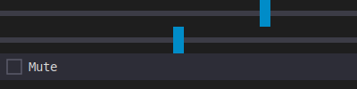</p>

**Composition** — nest structs. Reflection walks them recursively:

```cpp
struct Settings {
    prism::Field<std::string> username{"jeandet"};
    prism::Field<bool> dark_mode{true};
};

struct Dashboard {
    Settings settings;                   // nested group — recurses automatically
    prism::Field<prism::Slider<>> brightness{{.value = 0.6, .min = 0.0, .max = 1.0}};
    prism::Field<prism::Button> apply{{"Apply"}};
};
```

For custom layouts (e.g. `hstack`), add a `view()` method:

```cpp
void view(prism::WidgetTree::ViewBuilder& vb) {
    vb.vstack([&] {
        vb.component(settings);
        vb.hstack(brightness, apply);
    });
}
```

<p align="center">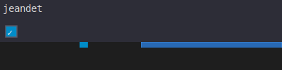</p>

**Resizable split panes** — drop a `handle()` between two children of any `hstack`/`vstack` to let
the user drag the divider; sizes stay content-based until the first drag, then persist and rescale
proportionally on resize:

```cpp
void view(prism::WidgetTree::ViewBuilder& vb) {
    vb.hstack([&] {
        vb.component(settings);
        vb.handle();
        vb.widget(brightness);
    });
}
```

**Canvas escape hatch** — drop to raw drawing when you need it:

```cpp
struct Waveform {
    prism::Field<prism::Slider<>> frequency{{.value = 3.0, .min = 0.5, .max = 8.0}};

    void canvas(prism::DrawList& dl, prism::Rect bounds, const prism::WidgetNode& node) {
        // Custom drawing: polyline, shapes, theme colors...
    }

    void view(prism::WidgetTree::ViewBuilder& vb) {
        vb.canvas(*this).depends_on(frequency);
        vb.widget(frequency);
    }
};
```

<p align="center">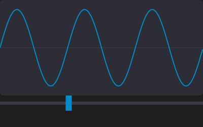</p>

**Plot widget** — scientific data visualization with zoom, pan, and crosshair:

```cpp
struct PlotShowcase {
    prism::plot::PlotModel plot;
    // ... populate with XYData series ...
    void view(prism::WidgetTree::ViewBuilder& vb) {
        vb.canvas(plot)
            .depends_on(plot.x_range).depends_on(plot.y_range)
            .depends_on(plot.view).depends_on(plot.cursor)
            .depends_on(plot.revision);
    }
};
```

<p align="center">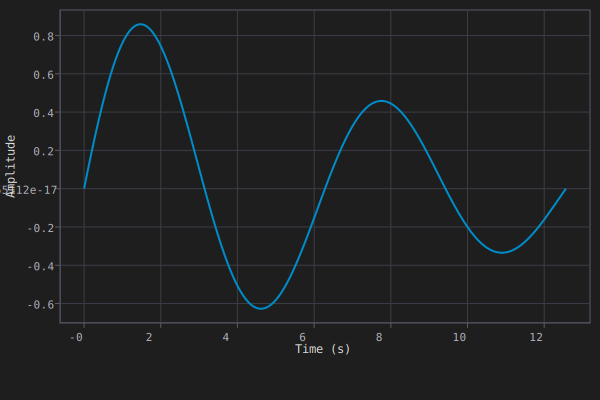</p>

**Live inspector** — point PRISM at any plain struct behind a `Shared<T>` and get a live,
per-field editable panel, no mirror struct to hand-write. Built for cross-thread state:
device drivers, background workers, plugin config living on another thread:

```cpp
struct DeviceState {
    float voltage = 3.3f;
    int mode = 2;
    bool enabled = true;
};

prism::Shared<DeviceState> device_state{DeviceState{}};       // owned/updated elsewhere
prism::inspector::Inspector<DeviceState> inspector(device_state);
```

`Inspector<T>` is an ordinary component — embed it in a larger UI via `vb.component()`, or
run it standalone like any model:

```cpp
prism::model_app("Device Control", inspector);
```

<p align="center">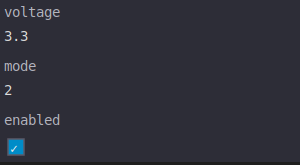</p>

**Tree widget** — lazy, virtualized tree view over any hierarchical data source, with keyboard
nav (arrow keys expand/collapse/move) and a synced detail panel. On C++26, `wrap_struct_tree()`
turns any nested struct into a browsable tree via reflection, no adapter code:

```cpp
struct Sensors { float battery_v = 3.7f; float bus_v = 12.1f; };
struct Device { std::string name = "Controller"; Sensors sensors; int firmware = 12; };

struct TreeShowcase {
    Device device;
    prism::TreeController ctrl{prism::wrap_struct_tree(device)};

    void view(prism::WidgetTree::ViewBuilder& vb) { vb.tree(ctrl); }
};
```

<p align="center">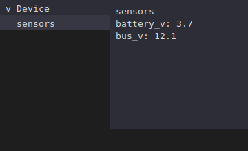</p>

For data that isn't a plain struct — a filesystem, a database, a custom model — implement
`TreeSource` by hand (Tier 1), or satisfy the `TreeStorage` concept and adapt it with
`wrap_tree_storage()` (Tier 2, see `examples/model_tree_browser/model_tree_browser.cpp` for a filesystem browser).
`wrap_struct_tree()` (Tier 3) is the reflection-only fast path shown above.

**Table widget** — virtualized rows with headers and single-row selection. `wrap_row_storage()`
turns a `List<T>` of `Field<T>`-bearing rows into a table via reflection; `wrap_column_storage()`
adapts any type satisfying `ColumnStorage` without reflection:

```cpp
struct Reading {
    prism::Field<std::string> sensor{""};
    prism::Field<double> value{0.0};
};

struct TableShowcase {
    prism::List<Reading> readings;

    void view(prism::WidgetTree::ViewBuilder& vb) {
        vb.table(readings).headers({"Sensor", "Value"});
    }
};
```

<p align="center">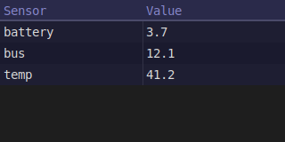</p>

**Tabs** — group content behind a tab bar. Each tab body is an independent `ViewBuilder` closure,
built lazily:

```cpp
struct TabsShowcase {
    prism::Field<prism::TextField<>> username{{.value = "jeandet"}};
    prism::Field<bool> dark_mode{true};
    prism::Field<prism::Slider<>> volume{{.value = 0.6}};
    prism::Field<prism::TabBar<>> tabs;

    void view(prism::WidgetTree::ViewBuilder& vb) {
        vb.tabs(tabs, [&] {
            vb.tab("Account", [&](prism::WidgetTree::ViewBuilder& tvb) {
                tvb.vstack(username, dark_mode);
            });
            vb.tab("Audio", [&](prism::WidgetTree::ViewBuilder& tvb) {
                tvb.widget(volume);
            });
        });
    }
};
```

<p align="center">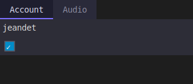</p>

**Inspector annotations** — customize how individual fields render in the inspector via
C++26 attributes, without changing the field's declared type:

```cpp
struct Settings {
    [[=prism::inspector::skip]]                  int internal_version;
    [[=prism::inspector::readonly]]               std::string device_id;
    [[=prism::inspector::label<"Sample Rate">]]   int sample_rate;
    [[=prism::inspector::section<"Audio">]]       float volume;
};
```

`skip` excludes a field entirely (still round-trips safely under the hood); `readonly` renders
it without input wiring; `label` overrides the caption; `section` inserts a header row above
the field.

## Core Abstractions: `Field<T>` and `State<T>`

Two observable types share the same core (`.get()`, `.set()`, `.on_change()`):

- **`Field<T>`** — data + observable + **widget** (reflection generates UI for it)
- **`State<T>`** — data + observable + **no widget** (backend state, synchronisation)

```cpp
struct Settings {
    prism::Field<std::string> username{"jeandet"};  // → text input
    prism::Field<bool>        dark_mode{true};       // → checkbox
    prism::State<std::string> session_token{""};     // → no widget, still observable
};
```

`Field<T>` holds only the value — no display label. The member name via P2996 reflection provides identity. Display labels are a form-layout concern.

Both support equality-guarded `set()` (no spurious notifications) and RAII `Connection` lifetime on `on_change()`.

Two more observable types round out the reactive core, both usable outside any widget tree:

- **`Derived<T>`** — read-only value recomputed from other observables, recalculated (and only notifies on actual change) whenever a source fires:
  ```cpp
  prism::Derived<double> total{[&]{ return price.get() * quantity.get(); }, price, quantity};
  ```
- **`Shared<T>`** — lock-free cross-thread cell (`get()`/`set()` from any thread); the owning thread calls `drain_notifications()` to fire `on_change()` on its own turn. This is what backs the `Shared<DeviceState>` in the live inspector example above — devices/background workers publish into it from another thread.

Wrap a batch of `field.set()` calls in `prism::transaction([&]{ ... })` to coalesce their notifications into one flush at the end of the block instead of firing per-call (see [Transaction API](docs/superpowers/specs/2026-04-04-transaction-api-design.md)).

## Sentinel Types & Widgets

The type inside `Field<T>` determines which **widget** (View layer) renders it. Sentinel types are templated wrappers that encode presentation semantics:

```cpp
enum class Theme { Light, Dark, System };

struct Editor {
    prism::Field<std::string>         title{""};                                    // → read-only text (default for StringLike)
    prism::Field<prism::Label<>>      status{{"OK"}};                               // → read-only label
    prism::Field<prism::TextField<>>  search{{.placeholder = "Search..."}};          // → editable text field
    prism::Field<prism::Password<>>   secret{{.placeholder = "API key"}};            // → masked input
    prism::Field<prism::Slider<>>     volume{{.value = 0.8}};                       // → continuous slider
    prism::Field<prism::Button>       save{{"Save"}};                               // → clickable button
    prism::Field<bool>                dark_mode{true};                              // → checkbox
    prism::Field<prism::Checkbox>     notify{{.checked = true, .label = "Enable"}}; // → checkbox with label
    prism::Field<Theme>               theme{Theme::Dark};                           // → auto-dropdown via reflection
    prism::Field<prism::Slider<int>>  quality{{.value = 3, .min = 1,
                                               .max = 5, .step = 1}};              // → discrete slider
};
```

Widgets are resolved at compile time via **concepts**, not concrete types. A widget matches on traits (`StringLike`, `Numeric`, `ScopedEnum`), so custom types work automatically if they satisfy the right concept:

```cpp
// Your own string type works in Label<> if it satisfies StringLike
prism::Field<prism::Label<MyString>> info{{my_string}};
// Any scoped enum gets an auto-dropdown via P2996 enumerators_of
prism::Field<MyEnum> mode{MyEnum::Default};
```

## Composition by Nesting

Models are plain structs. Compose by nesting — no inheritance, no macros:

```cpp
struct Settings {
    prism::Field<std::string> username{"jeandet"};
    prism::Field<bool>        dark_mode{true};
};

struct Dashboard {
    Settings settings;                   // nested group
    prism::Field<int> counter{0};
    prism::State<int> request_count{0};  // observable, no widget
};
```

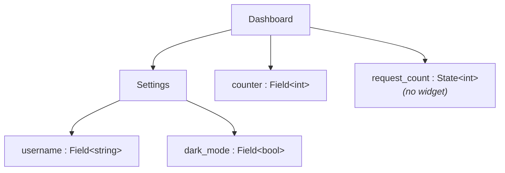

On C++26, P2996 reflection walks the struct members automatically — `Field<T>` gets a widget, `State<T>` is skipped, nested structs recurse. On C++23, each model provides a `view()` method using `vstack`/`hstack`:

```cpp
struct Dashboard {
    Settings settings;
    prism::Field<int> counter{0};

    void view(prism::WidgetTree::ViewBuilder& vb) {
        vb.vstack(settings, counter);   // Fields and nested components in one call
    }
};
```

Both paths produce identical output through an intermediate `Node` layer. No registration, no moc, no string-based identity.

## Three Entry Points

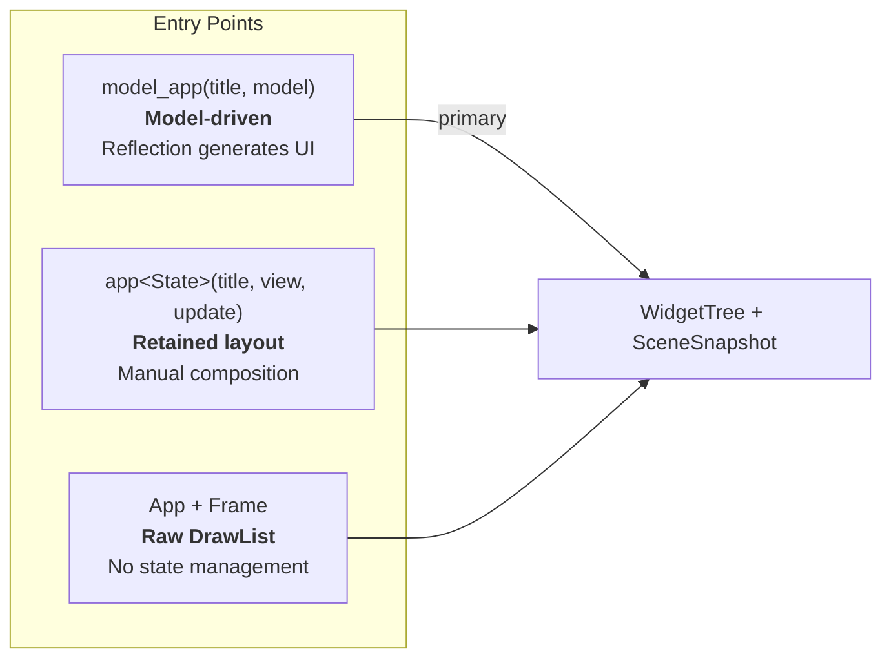

**1. Model-driven** (primary API) — define model structs, reflection does the rest:
```cpp
Dashboard dashboard;
prism::model_app("My App", dashboard);
```

**2. Retained layout** — manual `row()`/`column()`/`spacer()` composition:
```cpp
prism::app<State>("App", State{},
    [](auto& ui) { ui.column([&] { /* ... */ }); },
    [](State& s, const prism::InputEvent& ev) { /* ... */ }
);
```

**3. Raw DrawList** — direct rendering, no state management:
```cpp
using namespace prism::literals;
prism::App app({.title = "Hello", .width = 800, .height = 600});
app.run([](prism::Frame& frame) {
    frame.filled_rect({prism::Point{10_x, 10_y}, prism::Size{200_w, 100_h}},
                      prism::Color::rgba(0, 120, 215));
});
```

### Window Configuration

All three entry points take a `WindowConfig` — `model_app()` accepts one directly in place of a
bare title string:

```cpp
prism::model_app({.title = "My App", .width = 900, .height = 600,
                   .resizable = true, .decoration = prism::DecorationMode::Custom},
                  dashboard);
```

`decoration` selects the window chrome:

| Mode | Behavior |
|---|---|
| `DecorationMode::Custom` (default) | PRISM draws its own title bar, close/min/max buttons, and manual resize edges — works identically across platforms, including Wayland where server-side decoration is often unavailable |
| `DecorationMode::Native` | Defers to the OS window manager's decoration |
| `DecorationMode::None` | Borderless, undecorated window |

## Threading Model

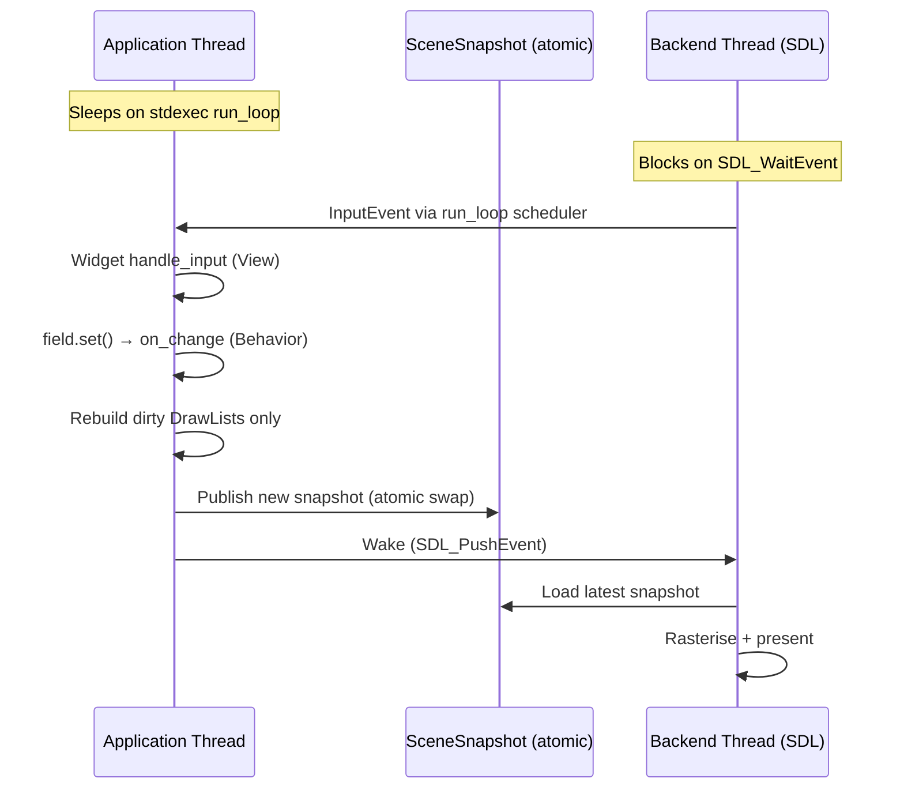

Both threads sleep at OS level when idle (futex / SDL event wait). Zero CPU when nothing changes.

## C++ Features

| Feature | Used for | Required |
|---|---|---|
| Static Reflection (P2996) | Auto-generate UI from model structs | **Optional** — `view()` method is the fallback |
| `std::execution` (P2300) | `run_loop` event loop, `prism::then` / `prism::on` pipe adaptors | Yes (via stdexec) |
| Senders/receivers | Observer pattern — `Field<T>::on_change()` + `SenderHub` | Yes |
| Concepts & Constraints | Widget resolution (`StringLike`, `Numeric`, `SliderRenderable`), strong type algebra | Yes (C++20) |
| `std::expected` | Fallible API operations — no exceptions at API boundary | Yes (C++23) |
| Designated initialisers | Named-parameter widget construction | Yes (C++20) |
| magic_enum | Enum introspection fallback when P2996 is unavailable | Auto — only on pre-C++26 |

## Building

**Minimum:** C++23 compiler (GCC 14+, Clang 17+) and **Meson >= 1.5**.

**With reflection:** GCC 16+ with `-freflection` (auto-detected by the build system). When available, model structs don't need a `view()` method — P2996 generates the UI automatically.

**Without reflection:** All model structs must provide a `view()` method that describes the widget tree via `ViewBuilder`. Enum dropdowns use magic_enum (fetched automatically as a Meson wrap).

```bash
meson setup builddir
ninja -C builddir
meson test -C builddir
```

The build auto-detects `-freflection` support and conditionally enables P2996. Dependencies (SDL3, stdexec, doctest, magic_enum) are fetched via Meson wraps.

## Roadmap

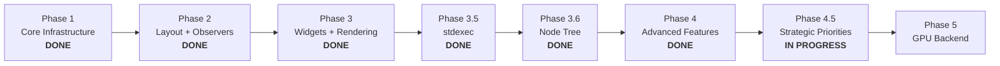

- **Phase 1** (done) — DrawList, SceneSnapshot, SDL3 backend, event-driven loop
- **Phase 2** (done) — Layout engine, hit testing, `Connection`/`SenderHub`, `Field<T>`, `List<T>`, P2996 reflection, `WidgetTree`, `model_app()`
- **Phase 3** (done) — Widget dispatch, SDL_Renderer + SDL3_ttf, all built-in widgets (Label, TextField, Password, TextArea, Slider, Button, Checkbox, Dropdown), overlay/popup system, keyboard focus (Tab/Shift+Tab), custom `view()` override, `canvas()` escape hatch, strong coordinate types, `clip_push` local coordinate system
- **Phase 3.5** (done) — stdexec `run_loop` event loops, `prism::then`/`prism::on` pipe adaptors, `AppContext`
- **Phase 3.6** (done) — `Node` intermediate layer (type-erased `Field<T>` + children), pre-C++26 support via `view()` methods, magic_enum enum fallback, `#if __cpp_impl_reflection` guards (only 2 locations)
- **Phase 4** (done) — Scroll areas, virtual lists, animation system (easing/spring, `Animation<T>`, `TransitionGuard<T>`), mouse capture & drag, table widget (virtual scroll, headers, row selection), tab bar (`TabBar<>`, lazy per-tab `ViewBuilder`), plot widget (zoom/pan/crosshair, auto-fit), SVG export, window abstraction + custom chrome, theme palette (runtime-switchable), transaction API (deferred/coalesced callbacks), `Derived<T>`/`Shared<T>` state taxonomy, codebase reorganization into 8 modules
- **Phase 4.5** (in progress) — Custom widget from type (`Widget<T>`, `is_widget_v`, `EditState`), live object inspector (`Inspector<T>`/`FieldMirror<T>` — edit a `Shared<T>` cross-thread with zero boilerplate), inspector field annotations (`skip`/`readonly`/`label`/`section` via C++26 `[[=...]]` attributes), `Tree<T>` widget (`TreeSource`/`TreeController`, `wrap_tree_storage()`/`wrap_struct_tree()`, virtualized rows, keyboard nav), live tree inspector (browse a running app's own `WidgetNode` tree, synced detail panel with auto-scroll); broader debugging/profiling story (dirty-region viewer) continues
- **Phase 5** — Vulkan/WebGPU backend, SDF text, tile compositing, Python bindings

## Design Documents

Detailed design rationale for each subsystem lives in [`doc/design/`](doc/design/):

- [Threading Model](doc/design/threading-model.md) — lock-free snapshot handoff, thread roles, input flow
- [Scene Snapshot](doc/design/scene-snapshot.md) — structure, versioning, dirty repaint model
- [Draw List](doc/design/draw-list.md) — command set, strong coordinate types, local coordinate system, serialisation
- [Render Backend](doc/design/render-backend.md) — BackendBase vtable, software vs GPU path
- [Input Events](doc/design/input-events.md) — input queue, event forwarding, hit testing
- [Layout Engine](docs/superpowers/specs/2026-03-27-layout-hit-regions-design.md) — row/column/spacer, two-pass solver, hit testing
- [Field/Sender/Widget Spec](docs/superpowers/specs/2026-03-27-field-sender-widget-design.md) — Field<T>, observer pattern, persistent widget tree
- [Widgets & Sentinels](doc/design/widgets-and-sentinels.md) — concept-driven widgets, all sentinel types (incl. TextArea), overlay system, focus policy
- [Input Routing](docs/superpowers/specs/2026-03-27-input-routing-design.md) — hit_test → dispatch → delegate handle_input → field mutation
- [stdexec Integration](doc/design/stdexec-integration.md) — run_loop event loops, prism::then/on pipe adaptors, AppContext
- [SDL_Renderer Migration](docs/superpowers/specs/2026-03-28-sdl-renderer-migration-design.md) — SDL_Renderer + SDL3_ttf replaces PixelBuffer surface-blit
- [Dynamic Node Tree](doc/design/dynamic-node-tree.md) — `Node` intermediate layer, pre-C++26 support, ViewBuilder→Node→WidgetNode pipeline
- [Styling](doc/design/styling.md) — theme as data, context propagation (draft)
- [Components](doc/design/components.md) — `prism::Component` base class, self-wiring reusable UI + logic bundles (design only)
- [Table Widget](docs/superpowers/specs/2026-03-31-table-widget-design.md) — `ColumnStorage`/`RowStorage` adapters, virtual scroll, headers, row selection
- [Tab Widget](docs/superpowers/specs/2026-03-31-tab-widget-design.md) — tabbed container, active-tab state
- [Plot Widget](docs/superpowers/specs/2026-04-01-plot-widget-design.md) — `PlotModel`, per-axis zoom/pan, crosshair, auto-fit
- [SVG Export](docs/superpowers/specs/2026-04-01-svg-export-draw-commands-design.md) — draw commands, viewport-aware `to_svg()`
- [Theme Palette](docs/superpowers/specs/2026-04-01-theme-palette-design.md) — flat `Theme` struct, runtime-switchable palette
- [Window Abstraction](docs/superpowers/specs/2026-04-01-window-abstraction-design.md) — `Window`/`WindowConfig`, custom chrome, manual resize tracking
- [Transaction API](docs/superpowers/specs/2026-04-04-transaction-api-design.md) — `prism::transaction()`/`TransactionGuard`, coalesced notifications
- [State Taxonomy](docs/superpowers/specs/2026-04-11-state-taxonomy-design.md) — `Derived<T>` signal graph, `Shared<T>` cross-thread cell
- [Custom Widget From Type](docs/superpowers/specs/2026-04-11-custom-widget-from-type-design.md) — `Widget<T>`, `is_widget_v`, `EditState`, user extension story
- [Live Object Inspector](docs/superpowers/specs/2026-07-14-live-object-inspector-design.md) — `Inspector<T>`/`FieldMirror<T>` reflection synthesis
- [Inspector Field Annotations](docs/superpowers/specs/2026-07-15-inspector-field-annotations-design.md) — `skip`/`readonly`/`label`/`section` C++26 attributes
- [Tree Widget](docs/superpowers/specs/2026-07-20-tree-widget-design.md) — `TreeSource`, 3-tier adapter API, virtualized rows, keyboard nav
- [Live Tree Inspector](docs/superpowers/specs/2026-07-15-live-tree-inspector-design.md) — live `WidgetNode` tree browser, dual-window event loop, detail panel auto-scroll

## License

MIT
