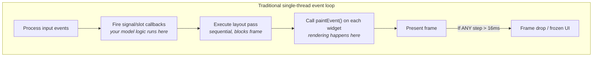
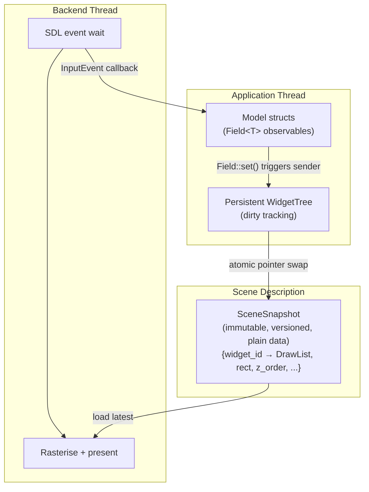
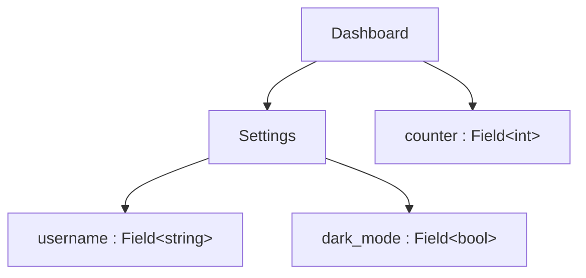
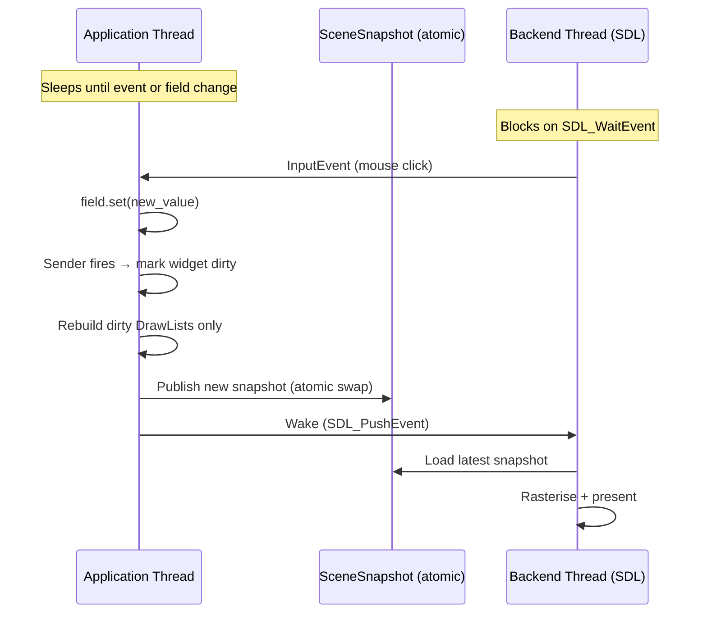
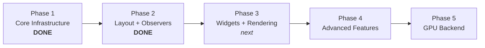

# PRISM — Persistent Rendering & Interactive Scene Model

**This is an R&D experiment** — exploring what a 2D UI toolkit could look like if built from scratch in C++26 with no legacy constraints. Nothing here is production-ready.

> Take Qt's persistent widget tree, strip away moc and QObject, replace signal/slot strings with C++26 senders, and let P2996 reflection generate the UI from plain structs.

## The Problem

Every major UI toolkit — Qt, GTK, wxWidgets — couples the application and the renderer on a single thread. Rendering competes with business logic for CPU time, and if any step exceeds the frame budget, the UI freezes.



This is an **architectural problem**, not a tuning problem.

## Architecture

PRISM decouples the application from the renderer through a versioned, immutable scene snapshot exchanged via atomic pointer swap. Both threads sleep at OS level when idle — zero CPU when nothing changes.



**The frame contract:** the renderer guarantees frame delivery independent of application state. The application never blocks the renderer. The renderer never calls into application code.

## Core Abstraction: `Field<T>`

`Field<T>` is the triple-duty building block — simultaneously **data**, **observable**, and **widget spec**:

```cpp
struct Settings {
    prism::Field<std::string> username{"Username", "jeandet"};
    prism::Field<bool>        dark_mode{"Dark Mode", true};
};
```

- **Data** — `field.get()` / `field.set(v)` with equality guard (no spurious notifications)
- **Observable** — `field.on_change().connect(callback)` with RAII `Connection` lifetime
- **Widget spec** — P2996 reflection maps `Field<bool>` to checkbox, `Field<string>` to text field, etc.

## Component Model

Components are plain model structs. Compose by nesting — no inheritance, no macros:

```cpp
struct Settings {
    prism::Field<std::string> username{"Username", "jeandet"};
    prism::Field<bool>        dark_mode{"Dark Mode", true};
};

struct Dashboard {
    Settings settings;                        // nested component
    prism::Field<int> counter{"Counter", 0};
};
```



C++26 reflection (`P2996`) walks the struct members at compile time — no registration, no moc, no string-based identity.

## Three Entry Points


**1. Model-driven** (primary API) — define model structs, reflection does the rest:
```cpp
Dashboard dashboard;
prism::model_app("My App", dashboard);
```

**2. Retained layout** — manual `row()`/`column()`/`spacer()` composition:
```cpp
prism::app<State>("App", State{},
    [](auto& ui) { ui.column([&] { /* ... */ }); },
    [](State& s, const prism::InputEvent& ev) { /* ... */ }
);
```

**3. Raw DrawList** — direct rendering, no state management:
```cpp
prism::App app({.title = "Hello", .width = 800, .height = 600});
app.run([](prism::Frame& frame) {
    frame.filled_rect({10, 10, 200, 100}, prism::Color::rgba(0, 120, 215));
});
```

## Threading Model



Both threads sleep at OS level when idle (futex / SDL event wait). Zero CPU when nothing changes.

## C++26 Features

| Feature | Used for |
|---|---|
| Static Reflection (P2996) | Walk model structs, map `Field<T>` to widgets, generate UI |
| `std::execution` (P2300) | Signal/slot scheduling, async pipeline (future) |
| Senders/receivers | Observer pattern — `Field<T>::on_change()` + `SenderHub` |
| Concepts & Constraints | Composability rules, clean error messages |
| `std::expected` | Fallible API operations — no exceptions at API boundary |
| Designated initialisers | Named-parameter widget construction |

## Building

Requires **GCC 16+** with C++26 reflection support and **Meson >= 1.5**.

```bash
meson setup builddir
ninja -C builddir
meson test -C builddir
```

The build automatically passes `-freflection` for P2996 support. Dependencies (SDL3, doctest) are fetched via Meson wraps.

## Roadmap



- **Phase 1** (done) — MPSC queue, DrawList, SceneSnapshot, SDL3 backend, event-driven loop
- **Phase 2** (done) — Layout engine, hit testing, `Connection`/`SenderHub`, `Field<T>`, `List<T>`, P2996 reflection, `WidgetTree`, `model_app()`
- **Phase 3** (next) — Real widget rendering, hit_test→sender routing, type-based widget dispatch, built-in widgets (button, label, text field, checkbox, slider)
- **Phase 4** — Async sender composition, animation, accessibility, data widgets (plot, table)
- **Phase 5** — Vulkan/WebGPU backend, SDF text, tile compositing, Python bindings

## Design Documents

Detailed design rationale for each subsystem lives in [`doc/design/`](doc/design/):

- [Threading Model](doc/design/threading-model.md) — lock-free snapshot handoff, thread roles, input flow
- [Scene Snapshot](doc/design/scene-snapshot.md) — structure, versioning, dirty repaint model
- [Draw List](doc/design/draw-list.md) — command set, extensibility, serialisation
- [Render Backend](doc/design/render-backend.md) — BackendBase vtable, software vs GPU path
- [Input Events](doc/design/input-events.md) — input queue, event forwarding, hit testing
- [Layout Engine](docs/superpowers/specs/2026-03-27-layout-hit-regions-design.md) — row/column/spacer, two-pass solver, hit testing
- [Field/Sender/Widget Spec](docs/superpowers/specs/2026-03-27-field-sender-widget-design.md) — Field<T>, observer pattern, persistent widget tree
- [Styling](doc/design/styling.md) — theme as data, context propagation (draft)

## License

MIT
