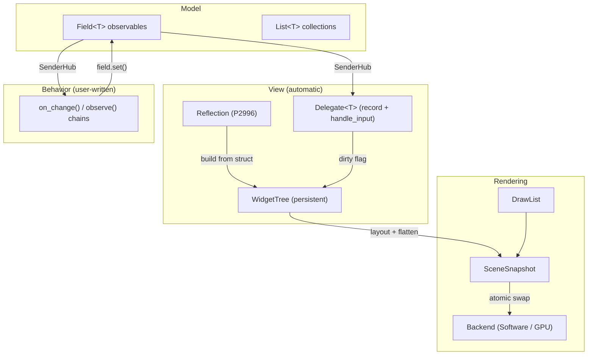

# PRISM Design Documents

Each document details the design, rationale, and constraints for one subsystem. They are meant to be read before implementing and updated as the design evolves.

## Architecture — Model-View-Behavior (MVB)

PRISM follows a **Model-View-Behavior** pattern — three clearly separated layers:

- **Model** — plain structs with `Field<T>` members. Data + change notification. Knows nothing about rendering or input.
- **View** — `Delegate<T>` specializations. How each field type renders (`record()`) and responds to raw input (`handle_input()`). Per-type, automatic via reflection. This is PRISM-internal.
- **Behavior** — user-written `on_change()` / `connect()` / `observe()` chains. Application logic (business rules, validation, cross-component coordination) that reacts to field mutations and drives other field mutations.

The key distinction from MVC/MVVM: View and Behavior are not mediated by a controller or view-model. The Model is the single source of truth. Delegates handle widget-level input mechanics (e.g. translating a click into a toggle). Behavior handles domain logic (e.g. "when volume exceeds 0.9, show a warning").

P2996 reflection bridges Model to View automatically — `Field<T>` structs become widgets with zero boilerplate.

## Documents

| Document | Subsystem | Status |
|---|---|---|
| [threading-model.md](threading-model.md) | Event-driven snapshot handoff, thread roles, input flow | **Implemented** |
| [scene-snapshot.md](scene-snapshot.md) | SceneSnapshot structure, versioning, dirty repaint model | **Implemented** |
| [draw-list.md](draw-list.md) | DrawList format, command set, serialisation, extensibility | **Implemented** |
| [render-backend.md](render-backend.md) | BackendBase vtable, SoftwareBackend, Backend wrapper | **Implemented** |
| [SDL_Renderer migration](../../docs/superpowers/specs/2026-03-28-sdl-renderer-migration-design.md) | SDL_Renderer + SDL3_ttf replaces PixelBuffer surface-blit | **Implemented** |
| [input-events.md](input-events.md) | Input queue, event forwarding, hit testing | **Implemented** |
| [layout engine](../../docs/superpowers/specs/2026-03-27-layout-hit-regions-design.md) | row/column/spacer, two-pass layout solver, hit testing | **Implemented** |
| [field/sender/widget](../../docs/superpowers/specs/2026-03-27-field-sender-widget-design.md) | Field<T>, SenderHub, WidgetTree, model_app() | **Implemented** |
| [input routing](../../docs/superpowers/specs/2026-03-27-input-routing-design.md) | hit_test → dispatch → on_input SenderHub → field mutation | **Implemented** |
| [app-facade.md](app-facade.md) | `prism::app<State>()` + `Ui<State>` retained entry point | **Implemented** — secondary API |
| [styling.md](styling.md) | Theme as data, context propagation, per-instance overrides | Draft |
| [delegates-and-sentinels.md](delegates-and-sentinels.md) | Delegate<T> + WidgetVisualState, all sentinels (Label/Slider/Button/Checkbox/TextField/Password/Dropdown), overlay system | **Implemented** |
| [stdexec integration](stdexec-integration.md) | run_loop event loops, prism::then/on pipe adaptors, AppContext | **Implemented** |
| [widget-model.md](widget-model.md) | Persistent widgets from Field<T> via reflection | **Superseded** by field/sender/widget spec |
| [reactivity.md](reactivity.md) | Sender/observer pattern, Field<T> change propagation | **Superseded** by field/sender/widget spec |

### Planned

| Document | Subsystem |
|---|---|
| [components.md](components.md) | `prism::Component` base class — self-wiring reusable UI + logic bundles | **Design only** |
| python-bindings | nanobind wrapping, GIL-free Python 3.14+, callback threading |
| testing-strategy | doctest, synchronous scheduler, headless rendering, visual regression |
| tracing-profiling | Tracy behind generic macros, trace points at pipeline boundaries |
