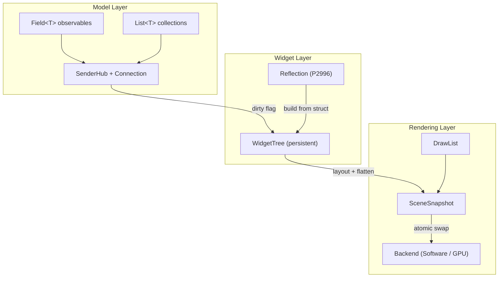

# PRISM Design Documents

Each document details the design, rationale, and constraints for one subsystem. They are meant to be read before implementing and updated as the design evolves.

## Architecture

PRISM is a persistent widget tree toolkit with C++26 sender-based observer pattern. `Field<T>` model structs are the core abstraction — simultaneously data, observable, and widget spec. P2996 reflection generates UI from plain structs.

## Documents

| Document | Subsystem | Status |
|---|---|---|
| [threading-model.md](threading-model.md) | Event-driven snapshot handoff, thread roles, input flow | **Implemented** |
| [scene-snapshot.md](scene-snapshot.md) | SceneSnapshot structure, versioning, dirty repaint model | **Implemented** |
| [draw-list.md](draw-list.md) | DrawList format, command set, serialisation, extensibility | **Implemented** |
| [render-backend.md](render-backend.md) | BackendBase vtable, SoftwareBackend, Backend wrapper | **Implemented** |
| [input-events.md](input-events.md) | Input queue, event forwarding, hit testing | **Implemented** |
| [layout engine](../../docs/superpowers/specs/2026-03-27-layout-hit-regions-design.md) | row/column/spacer, two-pass layout solver, hit testing | **Implemented** |
| [field/sender/widget](../../docs/superpowers/specs/2026-03-27-field-sender-widget-design.md) | Field<T>, SenderHub, WidgetTree, model_app() | **Implemented** |
| [input routing](../../docs/superpowers/specs/2026-03-27-input-routing-design.md) | hit_test → dispatch → on_input SenderHub → field mutation | **Implemented** |
| [app-facade.md](app-facade.md) | `prism::app<State>()` + `Ui<State>` retained entry point | **Implemented** — secondary API |
| [styling.md](styling.md) | Theme as data, context propagation, per-instance overrides | Draft |
| [delegates-and-sentinels.md](delegates-and-sentinels.md) | Delegate<T> dispatch, Label<T>/Slider<T> sentinels, State<T> | **Implemented** |
| [widget-model.md](widget-model.md) | Persistent widgets from Field<T> via reflection | **Superseded** by field/sender/widget spec |
| [reactivity.md](reactivity.md) | Sender/observer pattern, Field<T> change propagation | **Superseded** by field/sender/widget spec |

### Planned

| Document | Subsystem |
|---|---|
| python-bindings | nanobind wrapping, GIL-free Python 3.14+, callback threading |
| testing-strategy | doctest, synchronous scheduler, headless rendering, visual regression |
| tracing-profiling | Tracy behind generic macros, trace points at pipeline boundaries |
