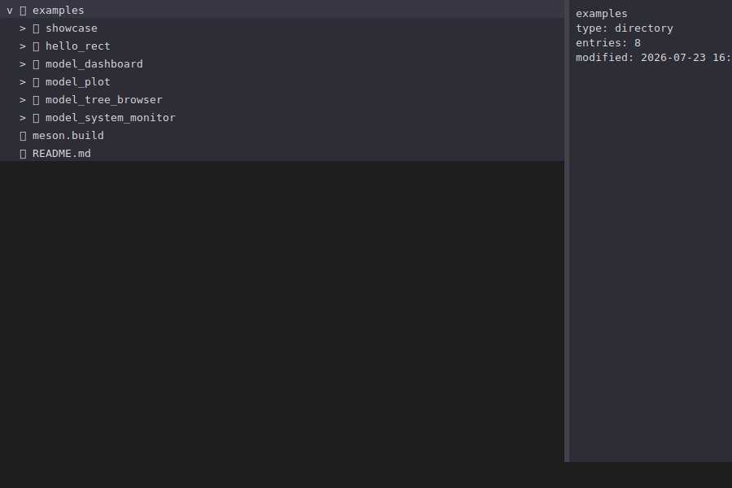

# Examples

Each subfolder is a standalone executable built alongside the library, plus its own README
walking through what it demonstrates and why it's built the way it is. They're ordered here
roughly by how much of PRISM they exercise, from a raw draw-list demo to a multi-threaded
reference app.

<table>
<tr>
<th>Example</th>
<th>Screenshot</th>
<th>Entry point</th>
<th>Demonstrates</th>
</tr>
<tr>
<td><a href="hello_rect/">hello_rect</a></td>
<td></td>
<td>Retained layout<br/><code>prism::app&lt;State&gt;</code></td>
<td>Manual <code>row()</code>/<code>column()</code>/<code>spacer()</code> composition, keyboard-driven state</td>
</tr>
<tr>
<td><a href="model_plot/">model_plot</a></td>
<td></td>
<td>Model-driven<br/><code>prism::model_app</code></td>
<td><code>PlotModel</code>, sliders driving a live chart via <code>.observe()</code></td>
</tr>
<tr>
<td><a href="model_tree_browser/">model_tree_browser</a></td>
<td></td>
<td>Model-driven</td>
<td>Tree widget over a hand-written <code>TreeStorage</code> filesystem adapter</td>
</tr>
<tr>
<td><a href="model_dashboard/">model_dashboard</a></td>
<td></td>
<td>Model-driven</td>
<td>Tabs, table, canvas escape hatch, animation, SVG export — the fullest tour of the widget set</td>
</tr>
<tr>
<td><a href="model_system_monitor/">model_system_monitor</a></td>
<td></td>
<td>Model-driven</td>
<td>Background-thread data ingestion via <code>Shared&lt;T&gt;</code>, live plots, sortable table/tree over real <code>/proc</code> data</td>
</tr>
</table>

`showcase/` is a separate, internal set of minimal snippets used only to auto-generate the
small feature screenshots embedded in the top-level README — not meant to be read as usage
examples in their own right.

## Building and running

```bash
meson setup builddir
ninja -C builddir
./builddir/examples/model_dashboard/model_dashboard
```

Swap in any example's directory name to run a different one. See the root
[README](../README.md#building) for full build prerequisites.

## Regenerating the screenshots

Every example doubles as its own screenshot generator: run it with an output path as `argv[1]`
and it renders one frame headlessly (via `CapturingBackend`) and writes an SVG instead of opening
a window. This is exactly what the `svg_<name>` custom target in each example's `meson.build`
does at build time (`build_by_default : true`), and is how the images in this file and in each
example's own README were produced:

```bash
ninja -C builddir examples/model_dashboard/model_dashboard.svg
cp builddir/examples/model_dashboard/model_dashboard.svg doc/screenshots/model_dashboard.svg
```

Meson's `custom_target` doesn't track header dependencies, so if you change a header without
touching the `.cpp` that includes it, delete the stale `.svg` under `builddir/` before rebuilding
or ninja won't notice it needs regenerating.
