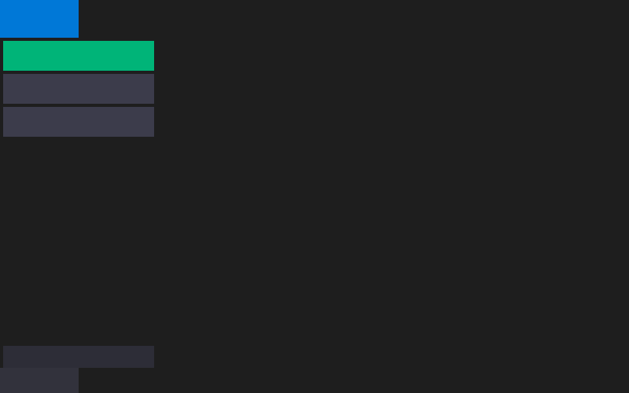

# hello_rect Example

Demonstrates PRISM's **retained layout** entry point — `prism::app<State>` — building a small
keyboard-driven panel selector out of `row()`/`column()`/`spacer()` containers and raw
`filled_rect()` draws, with no `Field<T>`/reflection involved anywhere.

<p align="center"></p>

## Overview

Every other example in this directory uses the model-driven entry point, `prism::model_app`,
where a plain struct's fields become the UI automatically (reflection) or via a `view()` method.
`hello_rect` instead uses PRISM's second, lower-level entry point: you hold your own `State`
struct, draw into a `Ui<State>&` each frame, and mutate `State` by hand in response to raw
`InputEvent`s. There's no dirty-tracking or reactive graph here — every frame rebuilds the whole
layout from scratch, the same way an immediate-mode UI would, except the containers
(`row()`/`column()`/`spacer()`) are retained and laid out by PRISM's layout engine rather than
hand-positioned.

This is the example to read first if you want to understand PRISM's *layout primitives* in
isolation, before the reactive `Field<T>`/`Widget<T>` machinery in the other examples enters the
picture.

## Walkthrough

**State** is as small as it gets — one field, no `Field<T>` wrapper:

```cpp
struct State {
    int selected_panel = 0;
};
```

**The view** is a plain lambda taking `auto& ui` (a `Ui<State>&`). It nests three containers —
an outer `column()` for header/body/footer, an inner `row()` splitting the body into
sidebar/content, and a `column()` of nav items inside the sidebar — using `ui.spacer()` wherever
a region should stretch to fill remaining space:

```cpp
ui.column([&] {
    ui.frame().filled_rect(R(0, 0, 100, 48), header);          // header bar
    ui.row([&] {
        ui.column([&] {                                        // sidebar
            nav_item(ui, 50, ui->selected_panel == 0 ? accent : muted);
            nav_item(ui, 50, ui->selected_panel == 1 ? accent : muted);
            nav_item(ui, 50, ui->selected_panel == 2 ? accent : muted);
            ui.spacer();
            nav_item(ui, 40, sidebar);
        });
        ui.spacer();                                            // content area
    });
    ui.frame().filled_rect(R(0, 0, 100, 32), footer);           // footer bar
});
```

`ui.frame()` returns a raw `DrawList`-like handle for direct drawing — there's no widget or
`Field<T>` behind these rectangles, just pixels. `ui->selected_panel` reads the current `State`
(the `Ui<State>::operator->()` accessor) to pick the highlighted nav item's color on every
rebuild.

**The update function** is a plain `(State&, const InputEvent&)` callback — no `Field<T>::set()`,
no reactive graph, just a direct mutation:

```cpp
[](State& s, const prism::InputEvent& ev) {
    if (auto* key = std::get_if<prism::KeyPress>(&ev)) {
        switch (key->key) {
        case SDLK_1: s.selected_panel = 0; break;
        case SDLK_2: s.selected_panel = 1; break;
        case SDLK_3: s.selected_panel = 2; break;
        default: break;
        }
    }
}
```

Pressing `1`, `2`, or `3` changes `selected_panel`; the next frame's `view()` call picks that up
and repaints the corresponding nav item in the accent color.

**Headless capture.** Run with an output path (`hello_rect out.svg`) and `main()` takes a
different branch: it builds a `Backend` around a `CapturingBackend` instead of the real SDL
backend, calls the `(Backend&, Window&, State, view, update)` overload of `prism::app<State>`
(the same overload `model_app` mirrors for the model-driven entry point), and writes the one
captured frame to SVG. This is what the screenshot above was generated from, and what the
`svg_hello_rect` build target regenerates automatically.

## Key concepts

- **Entry point 2 of 3** — see the root [README's "Three Entry Points"](../../README.md#three-entry-points) for how this compares to `model_app` (entry point 1, used by every other example) and raw `App`+`Frame` (entry point 3).
- `Ui<State>::row()`/`column()`/`spacer()` — retained layout containers, measured and arranged by PRISM's layout engine each rebuild.
- `Ui<State>::frame()` — the raw-draw escape hatch inside retained layout, analogous to `canvas()` in the model-driven API.

## Building and running

```bash
ninja -C builddir examples/hello_rect/hello_rect
./builddir/examples/hello_rect/hello_rect
```

## See also

- [`model_plot`](../model_plot/) — the smallest model-driven example, for comparison.
