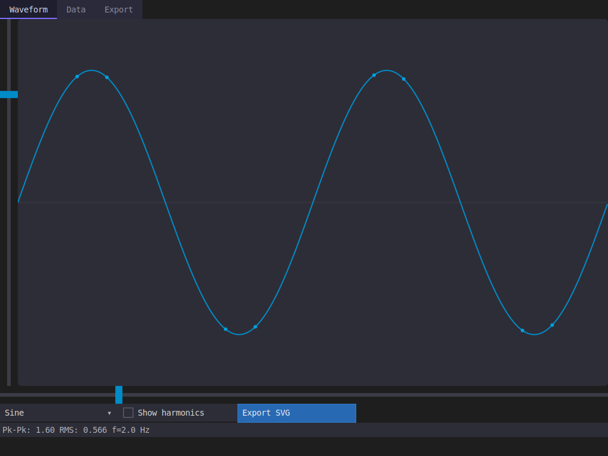

# model_dashboard Example

The fullest tour of PRISM's widget set: a three-tab signal generator combining tabs, a table, the
canvas escape hatch, spring animation, and SVG export in one model.

<p align="center"></p>

## Overview

`SignalGenerator` is the root model, split across three tabs:

- **Waveform** — shape dropdown, frequency/amplitude sliders, a live waveform drawn through the
  `canvas()` escape hatch, and a stats label kept in sync with the current parameters.
- **Data** — a scrollable `table()` over a computed-columns source (`SignalTable`) that samples
  the waveform per row — no data is stored, every cell is computed on read.
- **Export** — a text field, button, `TextArea`, and an append-only `List<std::string>` log; the
  export button drives a `canvas()`-drawn progress bar through a spring animation.

## Walkthrough

**The canvas escape hatch.** `Waveform` isn't a `Widget<T>` — it draws itself via a `canvas(...)`
member and declares its redraw dependencies explicitly:

```cpp
void canvas(prism::DrawList& dl, prism::Rect bounds, const prism::WidgetNode& node) {
    auto& t = *node.theme;
    draw_waveform(dl, bounds, current_params(), t.surface, t.track, t.accent, t.accent_hover);
}

void view(prism::WidgetTree::ViewBuilder& vb) {
    vb.hstack([&] {
        vb.widget(amplitude);
        vb.canvas(*this)
            .depends_on(frequency).depends_on(amplitude)
            .depends_on(shape).depends_on(harmonics);
    });
    ...
}
```

`draw_waveform()` itself is a free function, shared verbatim between this on-screen canvas draw
and the SVG-export button below — same drawing code, two different `DrawList` destinations.

**A table over computed data.** `SignalTable` has no stored rows at all — `cell_text(r, c)`
resamples the waveform for row `r`, column `c` on every read:

```cpp
struct SignalTable {
    static constexpr size_t N = 50;
    const Waveform& wf;

    size_t row_count() const { return N; }
    std::string cell_text(size_t r, size_t c) const {
        float t = static_cast<float>(r) / static_cast<float>(N);
        float val = wf.amplitude.get().value * wave_value(wf.shape.get(), std::fmod(wf.frequency.get().value * t, 1.f));
        ...
    }
};
```

Placed with `.depends_on(waveform.frequency, waveform.amplitude, waveform.shape)` so the table
repaints whenever those change, even though it never stores a copy of the data.

**A second canvas driven by animation**, not a field change — `ProgressBar` repaints because its
one dependency (`progress`) is itself being driven by `prism::animate()`, not a user edit:

```cpp
struct ProgressBar {
    prism::Field<float> progress{0.f};
    void canvas(prism::DrawList& dl, prism::Rect bounds, const prism::WidgetNode& node) { ... }
    void view(prism::WidgetTree::ViewBuilder& vb) { vb.canvas(*this).depends_on(progress); }
};
```

**Wiring**, in `main()` — `update_stats()` is hoisted above `setup` and called once immediately
(not just registered as a reaction), so the stats label is correct from the very first frame
rather than only after the first parameter change:

```cpp
auto update_stats = [&app] {
    float rms = amp * rms_value(app.waveform.shape.get());
    app.waveform.stats.set({fmt::format("Pk-Pk: {:.2f}  RMS: {:.3f}  f={:.1f} Hz", 2.f * amp, rms, freq)});
};
update_stats();   // seed the label before the first frame, not just react to future changes

auto setup = [&](prism::AppContext& ctx) {
    auto sched = ctx.scheduler();
    connections.push_back(
        app.waveform.frequency.on_change()
        | prism::on(sched)
        | prism::then([update_stats](const prism::Slider<>&) { update_stats(); })
    );
    ...
};
```

Unlike `model_plot`'s `.observe()`, these reactions go through `.on_change() | prism::on(sched) |
prism::then(...)` — a `Connection`-returning pipeline run explicitly on the app's scheduler,
which is what the export button's spring animation needs (`ctx.clock()`) and what makes the
`then()` callbacks capture `update_stats` *by value*: the `Connection`s they belong to outlive
`setup()` itself, held in a `main()`-scope `std::vector<prism::Connection>`.

**The export button's SVG output** reuses `draw_waveform()` directly against a throwaway
`DrawList`, entirely outside the normal render pass:

```cpp
prism::DrawList dl;
draw_waveform(dl, bounds, app.waveform.current_params(), ...);
std::ofstream(fname) << prism::to_svg(dl);
```

**Headless capture.** The same `setup` lambda used for the interactive `model_app()` call is
reused for the headless branch via the shared `showcase()` helper (`examples/showcase/showcase_common.hpp`),
which now has an overload accepting a setup callback:

```cpp
if (argc >= 2) {
    return showcase(argc, argv, app, 1024, 768, std::function<void(prism::AppContext&)>(setup));
}
prism::model_app({.title = "PRISM Signal Generator", ...}, app, setup);
```

## Key concepts

- `canvas()` + `.depends_on(...)` — draw-your-own-widget escape hatch; see [model_plot](../model_plot/) for the simplest possible use of it.
- Computed-on-read table data — a table source doesn't need to store rows, only compute them.
- `.on_change() | prism::on(sched) | prism::then(...)` — the `Connection`-based reaction pipeline, for when a reaction needs a specific scheduler (vs. `.observe()`'s fire-and-forget).
- `prism::animate()` + `AppContext::clock()` — spring-driven `Field<float>` animation feeding a `canvas()` redraw.
- `prism::to_svg(DrawList)` — rendering a `DrawList` to SVG outside the normal window render pass.

## Building and running

```bash
ninja -C builddir examples/model_dashboard/model_dashboard
./builddir/examples/model_dashboard/model_dashboard
```

## See also

- [`model_plot`](../model_plot/) — the same `canvas()`/`.depends_on()` pattern, minus tabs and animation.
- [`model_system_monitor`](../model_system_monitor/) — tabs and a table again, this time fed by background threads instead of user input.
