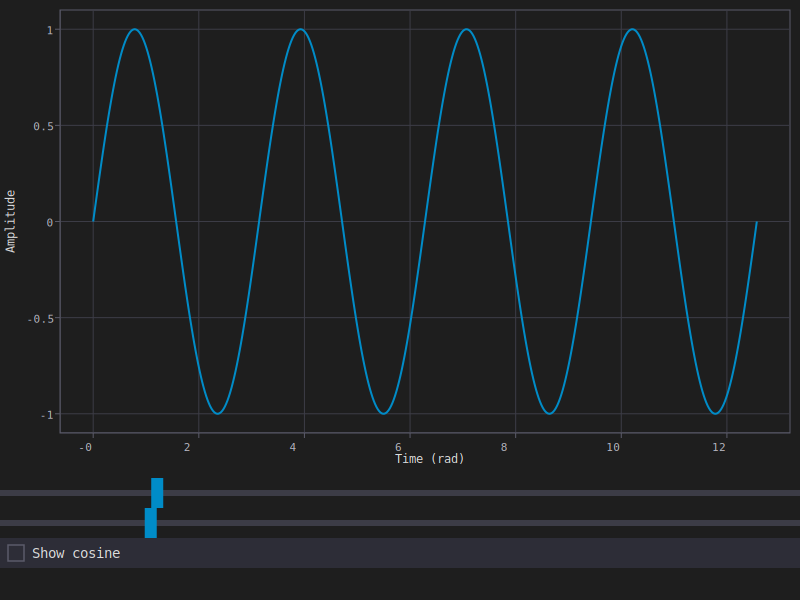

# model_plot Example

The smallest model-driven example: two sliders and a checkbox drive a live sine/cosine chart.
Good first stop for the reactive `Field<T>` + `PlotModel` combination before the fuller
[`model_dashboard`](../model_dashboard/) example.

<p align="center"></p>

## Overview

`PlotDemo` holds a frequency slider, an amplitude slider, a "show cosine" checkbox, and a
`prism::plot::PlotModel`. `update_data()` recomputes both series from the sliders' current
values and pushes them into the plot; every control's `.observe()` callback just calls
`update_data()` again. There's no manual redraw bookkeeping — placing the plot with `canvas()`
and declaring which of its fields it `.depends_on(...)` is what tells PRISM to repaint it
whenever any of those fields change.

## Walkthrough

**The model:**

```cpp
struct PlotDemo {
    prism::Field<prism::Slider<>> frequency{{.value = 2.0, .min = 0.1, .max = 10.0}};
    prism::Field<prism::Slider<>> amplitude{{.value = 1.0, .min = 0.1, .max = 5.0}};
    prism::Field<prism::Checkbox> show_cos{{.checked = false, .label = "Show cosine"}};
    prism::plot::PlotModel plot;

    void update_data() {
        double f = frequency.get().value;
        double a = amplitude.get().value;
        // ... sample xs/ys_sin/ys_cos over N points ...
        plot.clear_series();
        plot.add_series(prism::plot::XYData{xs, ys_sin}, prism::plot::SeriesStyle{colors[0], 2.f});
        if (show_cos.get().checked) {
            plot.add_series(prism::plot::XYData{std::move(xs), std::move(ys_cos)},
                            prism::plot::SeriesStyle{colors[2], 2.f});
        }
        plot.notify();
    }
    ...
};
```

`plot.notify()` at the end marks the plot's `revision` field dirty — that's the mechanism the
next step hooks into.

**The view** places the plot via `canvas()` (a `PlotModel` isn't a `Widget<T>` itself; it draws
through the canvas escape hatch) and declares every field a repaint should react to:

```cpp
void view(prism::WidgetTree::ViewBuilder& vb) {
    vb.canvas(plot)
        .depends_on(plot.x_range)
        .depends_on(plot.y_range)
        .depends_on(plot.view)
        .depends_on(plot.cursor)
        .depends_on(plot.revision);
    vb.widget(frequency);
    vb.widget(amplitude);
    vb.widget(show_cos);
}
```

`x_range`/`y_range`/`view`/`cursor` cover the plot's own interactive state (zoom, pan, crosshair);
`revision` is what `update_data()`'s `plot.notify()` bumps, so a slider drag propagates:
slider change → `.observe()` callback → `update_data()` → `plot.notify()` → `revision` dirty →
canvas repaints.

**Wiring**, in `main()`:

```cpp
demo.update_data();   // seed the very first frame — see "Headless capture" below

auto setup = [&](prism::AppContext&) {
    demo.frequency.observe([&](const prism::Slider<>&) { demo.update_data(); });
    demo.amplitude.observe([&](const prism::Slider<>&) { demo.update_data(); });
    demo.show_cos.observe([&](const prism::Checkbox&) { demo.update_data(); });
};
```

`.observe()` is fire-and-forget — no `Connection` to store or manage, unlike the
`.on_change() | prism::on(sched) | prism::then(...)` pipeline `model_dashboard` uses when it
needs to run on a specific scheduler.

**Headless capture.** Calling `demo.update_data()` *before* `model_app()` runs at all (rather
than only inside `setup`) is what makes `model_plot demo.svg` produce a correct screenshot: the
very first snapshot PRISM builds already reflects real data, so the headless capture path (which
never fires any `.observe()` callback, since no slider is ever dragged) still renders the right
curves.

## Key concepts

- `canvas()` + `.depends_on(...)` — the escape hatch for drawing an object that isn't itself a `Widget<T>`, repainting only when its declared dependencies change. See the root README's [Composition by Nesting](../../README.md#composition-by-nesting) section.
- `Field<T>::observe()` — fire-and-forget reactive callback; no `Connection` to store or disconnect, unlike `.on_change() | prism::on(sched) | prism::then(...)`.
- `PlotModel` — per-axis zoom/pan/crosshair state, driven entirely through `Field<T>` members.

## Building and running

```bash
ninja -C builddir examples/model_plot/model_plot
./builddir/examples/model_plot/model_plot
```

## See also

- [`model_dashboard`](../model_dashboard/) — a canvas driven by `.on_change()` + a scheduler instead of `.observe()`, plus the full widget tour.
