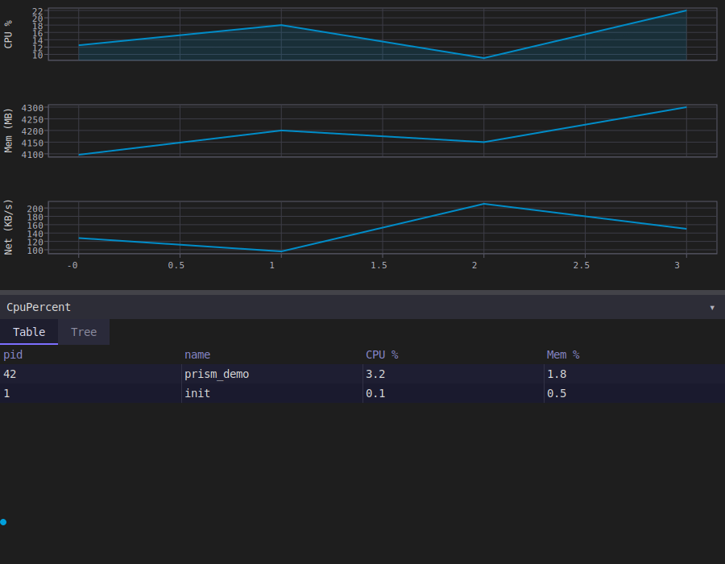

# model_system_monitor Example

A fancy-htop: two background threads poll `/proc` and publish into PRISM's cross-thread cell,
`Shared<T>`, while the UI thread drains it into live plots, a sortable table, and a process tree.
The most realistic, multi-threaded example in this directory.

<p align="center"></p>

## Overview

Two `std::jthread`s (`poll_system_loop`, `poll_processes_loop` in `proc_metrics.hpp`) read
`/proc/stat`, `/proc/meminfo`, `/proc/net/dev`, and per-process `/proc/<pid>/{stat,status}`,
computing CPU/mem/net deltas and a full process list, then publish into two `Shared<T>` cells.
The UI thread never touches `/proc` directly — it only ever reads through
`Shared<T>::observe()`, called during a drain the model opts into explicitly.

## Walkthrough

**Cross-thread ingest.** `SystemMonitor` holds its background-fed state in `Shared<T>`, not
`Field<T>` — and its own `drain()` method is how those two fields get flushed into the reactive
graph on the UI thread's turn:

```cpp
struct SystemMonitor {
    // Background-thread ingest points. Never placed via vb.widget() -- they are read only
    // through .observe(), which fires during drain via the void drain() opt-in below.
    prism::Shared<SystemSample> sys_sample{};
    prism::Shared<std::vector<ProcessInfo>> proc_list{};
    ...

    void drain() {
        sys_sample.drain_notifications();
        proc_list.drain_notifications();
    }
};
```

A model exposing a `void drain()` method is itself a piece of reflection-driven wiring — PRISM's
app loop calls it on every tick, exactly the same as it would call a `view()` method. The
"harmless not-placed-by-view() debug warning" for these two fields is expected: they're
deliberately never given a `Widget<T>` of their own.

**Ingest → derived state**, run from `.observe()` callbacks registered in `main()`'s setup:

```cpp
app.sys_sample.observe([&app](const SystemSample& s) { app.ingest_system(s); });
app.proc_list.observe([&app](const std::vector<ProcessInfo>& p) { app.ingest_processes(p); });
```

`ingest_processes()` is where the reflection-tiered table support pays off — no hand-rolled diff
loop, just a full-replace call plus the same list feeding a second, tree-shaped view of the same
data:

```cpp
void ingest_processes(const std::vector<ProcessInfo>& processes) {
    table_rows.replace_all(sort_by(processes, sort_key.get()));
    tree_source.update(processes);
    tree_ctrl.refresh();
}
```

`table_rows` is a `prism::List<ProcessInfo>` — `ProcessInfo` is a plain reflectable struct, so the
table widget derives its columns and cell rendering from its fields directly, no `ProcessRow`
twin struct needed. `tree_source` (`FlatProcessTreeSource`, in `process_tree_source.hpp`) builds
a parent→children index from the same flat `ProcessInfo` list via `build_process_tree_index()`,
giving the "Tree" tab a hierarchical view of the exact same data the "Table" tab shows flat.

**Multiple plots, one dependency pattern**, using the variadic form of `.depends_on(...)`:

```cpp
vb.canvas(cpu_plot)
    .depends_on(cpu_plot.x_range, cpu_plot.y_range, cpu_plot.view,
                cpu_plot.cursor, cpu_plot.revision)
    .min_size(prism::Height{120});
```

**The heartbeat** — a third `canvas()`, this one driven purely by the animation clock rather
than any data at all, proving the same `canvas()` + `.depends_on()` pattern covers "redraw
because a clock ticked" just as well as "redraw because a field changed":

```cpp
ctx.clock().add([&app](prism::AnimationClock::time_point now) {
    double phase = std::fmod(t * 4.0, 2.0 * std::numbers::pi); // ~4 rad/s
    app.heartbeat_phase.set(static_cast<float>(phase));
    return true; // never remove -- keeps the tick perpetually re-scheduling
});
```

The `std::fmod` before the cast to `float` matters: `now.time_since_epoch()` is `steady_clock`
time since boot, which on a long-uptime machine is large enough that casting straight to `float`
loses precision below one frame's worth of phase advance — silently freezing the heartbeat
(`Field<T>::set()` no-ops on an unchanged value) instead of animating it smoothly.

**Requires reflection** (`__cpp_impl_reflection`) — `ProcessInfo`, `table_rows`, and the model's
implicit `view()` all depend on P2996 struct reflection being available. Without it, `main()`
degrades to writing a stub SVG so the build still succeeds on older compilers, rather than
failing outright.

**Headless capture.** `main()` seeds a small hard-coded process list (`seed_demo_data()`) before
capturing, rather than relying on the two background pollers — a static single-frame capture
can't wait for `/proc` polling to land real data:

```cpp
if (argc >= 2) {
    app.seed_demo_data();
    return showcase(argc, argv, app, 900, 700);
}
```

## Key concepts

- `Shared<T>` — the lock-free cross-thread cell; `.get()`/`.set()` from any thread, `.observe()`/`drain_notifications()` on the owning thread. See the root README's [Threading Model](../../README.md#threading-model).
- `void drain()` — the model-level opt-in that makes PRISM's app loop flush `Shared<T>` notifications every tick.
- `List<ProcessInfo>::replace_all` + the reflected-struct table tier — a plain-struct row type drives the table with no manual column/diff code.
- Variadic `.depends_on(a, b, c, ...)` — one call instead of chained `.depends_on()`s.
- `canvas()` driven by an `AnimationClock` tick instead of a `Field<T>` change — the heartbeat.

## Building and running

```bash
ninja -C builddir examples/model_system_monitor/model_system_monitor
./builddir/examples/model_system_monitor/model_system_monitor
```

Pass an output path as `argv[1]` (as the `svg_system_monitor` custom target does) to run
headlessly and dump a single-frame SVG snapshot instead of opening a window.

## See also

- [`model_tree_browser`](../model_tree_browser/) — the same `TreeController`, over the filesystem instead of an in-memory process list.
- [`model_dashboard`](../model_dashboard/) — tabs and a table again, fed by user input instead of background threads.
